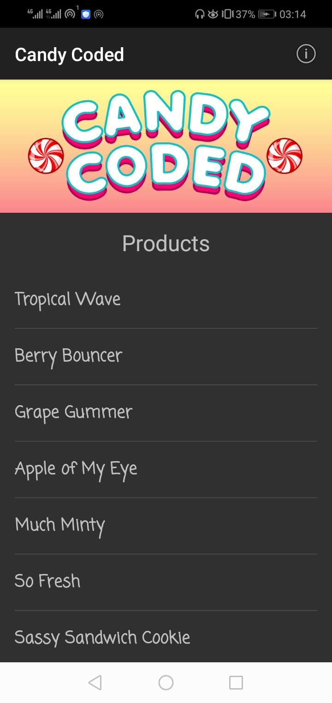
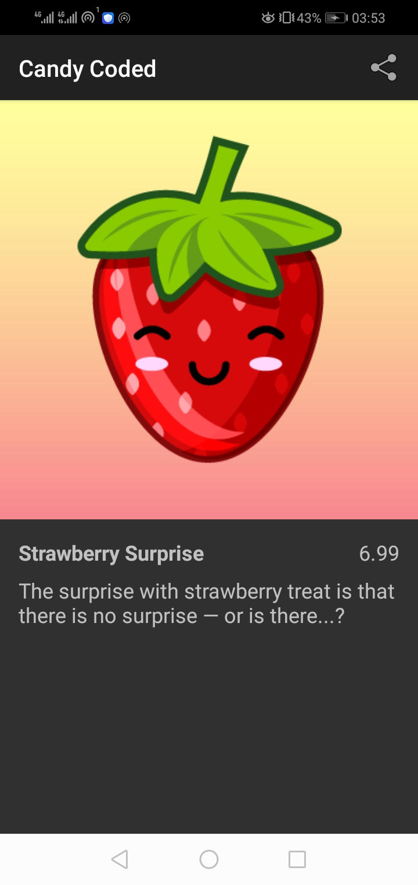
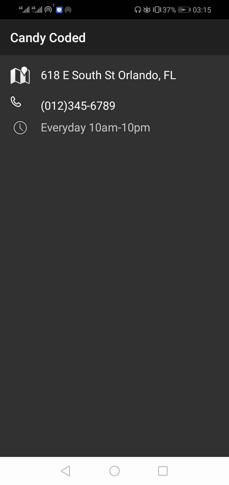
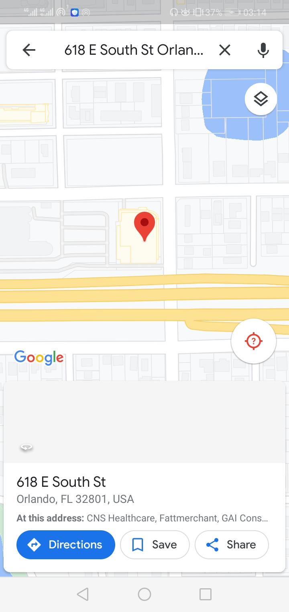
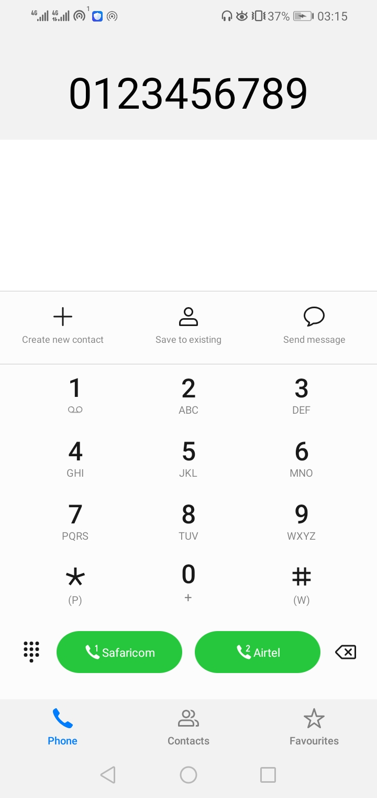
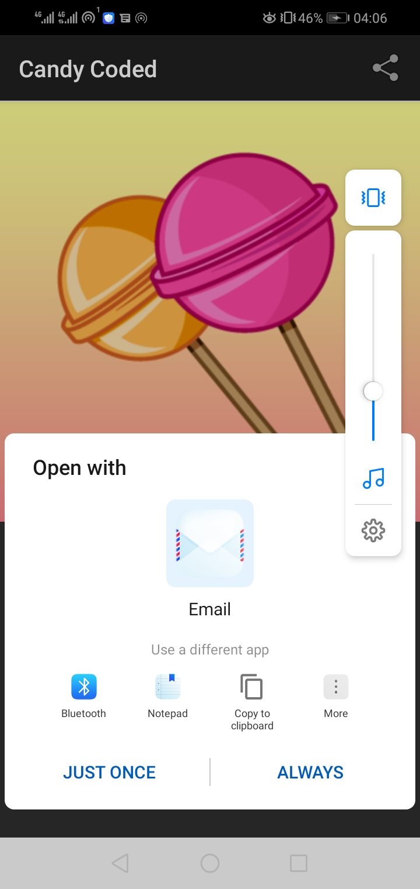

# Andela Learning Community project for phase 3 on Associate Android Developers Track
This repo contains the code for the Pluralsight Project "Add Implicit and Explicit Intents to an Android Candy Store App," located here: https://app.pluralsight.com/projects/add-implicit-and-explicit-intents-to-an-android-candy-store-app/
This is a complete beginners project covering concepts like  
    1. database  
    2. Implicit and Explicit Intents  
    3. Unit Testing

# The UI

  
   
  
  
  
  

